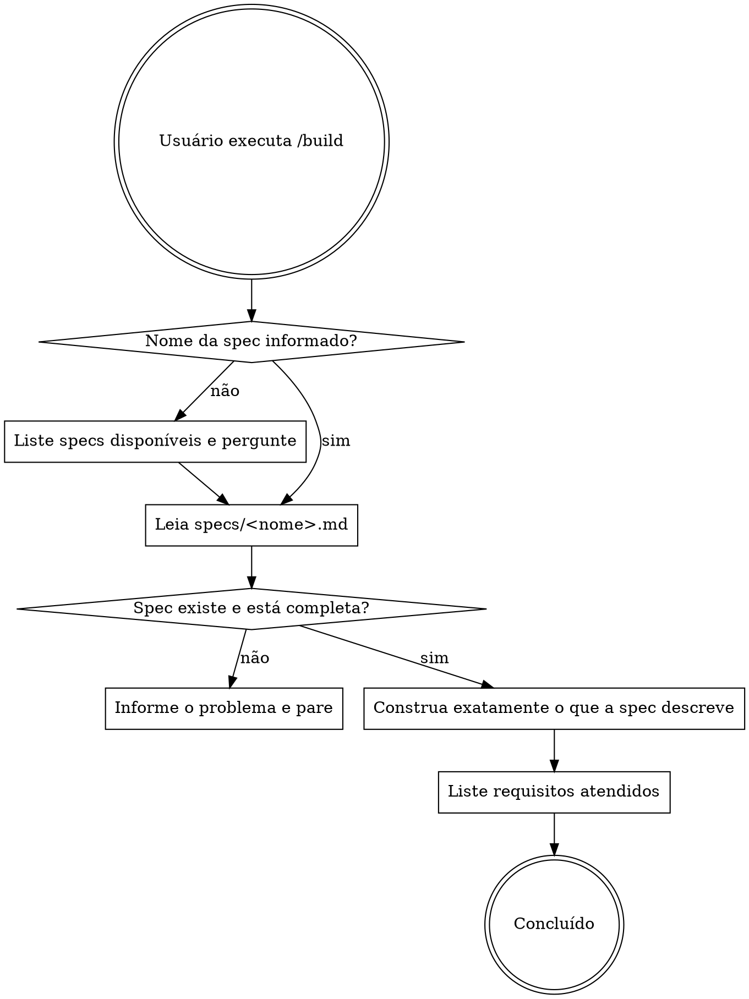

# Build — Construir a partir da especificação

## Overview

Leia a spec, construa exatamente o que ela descreve, nada mais. Ao terminar, liste os requisitos atendidos para facilitar a revisão.

## Processo



## Regras durante a construção

- **Construa apenas o que está na spec.** Nenhum requisito implícito, nenhuma melhoria não solicitada.
- **Não refatore código irrelevante.** Se algo fora do escopo da spec parecer errado, ignore ou mencione ao final — nunca mude.
- **Não adicione funcionalidades extras.** "Enquanto estou aqui" não existe.
- **Não invente casos extremos não descritos.** Implemente apenas os listados na spec.
- **Se algo na spec for ambíguo**, pare e pergunte antes de interpretar livremente.

## Saída ao concluir

Ao terminar, exiba obrigatoriamente:

```
## Requisitos atendidos

- [x] <Requisito 1 exatamente como na spec>
- [x] <Requisito 2>
- ...

## Definição de concluído

- [x] <Critério verificável 1>
- [x] <Critério verificável 2>
- ...
```

Se algum item não foi atendido, marque com `[ ]` e explique o motivo em uma linha.

## Erros comuns

| Tentação | O que fazer |
|---|---|
| "Vou aproveitar e melhorar X" | Não. Foque na spec. |
| "A spec não menciona validação, mas faz sentido adicionar" | Só adicione se estiver na spec. |
| "Esse trecho parece errado, vou refatorar" | Mencione ao final, não toque. |
| "Vou interpretar esse requisito ambíguo da forma mais completa" | Pare e pergunte. |
