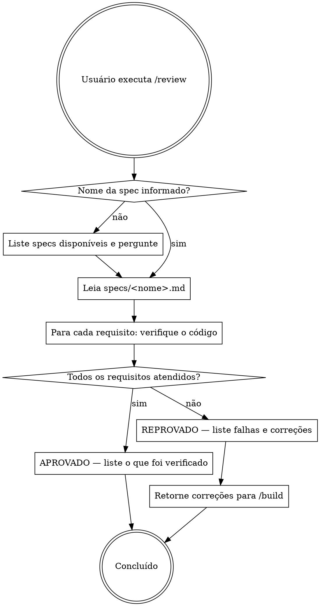

# Review — Verificar build contra a especificação

## Overview

Compare o código atual com a spec, requisito por requisito. Aprove apenas quando tudo estiver atendido. Se houver falhas, produza correções precisas para o /build aplicar.

## Processo



## Como verificar cada requisito

Para cada item dos **Requisitos** e da **Definição de concluído** da spec:

1. Localize o código correspondente (arquivo, função, rota, componente)
2. Verifique se o comportamento implementado corresponde exatamente ao descrito
3. Verifique os casos extremos listados na spec
4. Marque como `[x]` (atendido) ou `[ ]` (falha) com evidência

**Seja específico:** cite arquivo e linha, não apenas "não implementado".

## Saída quando APROVADO

```
## Review: APROVADO ✓

Spec: specs/<nome>.md

### Requisitos verificados
- [x] <Requisito 1> — <arquivo:linha ou evidência>
- [x] <Requisito 2> — <arquivo:linha ou evidência>
- ...

### Definição de concluído
- [x] <Critério 1> — verificado
- [x] <Critério 2> — verificado
- ...

Build aprovada. Todos os requisitos da spec foram atendidos.
```

## Saída quando REPROVADO

```
## Review: REPROVADO ✗

Spec: specs/<nome>.md

### Falhas encontradas

**[FALHA 1]**
- Requisito da spec: "<texto exato do requisito>"
- Problema: <descrição objetiva do que está errado ou ausente>
- Localização: <arquivo:linha ou "não implementado">
- Correção necessária: <instrução precisa do que /build deve fazer>

**[FALHA 2]**
- Requisito da spec: "<texto exato do requisito>"
- Problema: ...
- Localização: ...
- Correção necessária: ...

### Itens aprovados
- [x] <Requisito que passou>
- ...

### Itens reprovados
- [ ] <Requisito que falhou>
- ...

Retorne ao /build com as correções acima antes de uma nova revisão.
```

## Regras

- **Revise contra a spec, não contra suas expectativas.** Se a spec não pede, não reprove por ausência.
- **Não sugira melhorias além da spec.** Só falhas em relação ao que está escrito.
- **Nunca aprove parcialmente.** Aprovação = 100% dos requisitos e critérios de conclusão atendidos.
- **Cada falha deve ter uma correção acionável.** "Está errado" não é correção. "Adicione validação X no arquivo Y, função Z" é.
- **Cite o texto exato da spec** em cada falha para que o /build saiba qual requisito implementar.

## Erros comuns

| Erro | Consequência |
|---|---|
| Aprovar com itens parcialmente atendidos | A build vai para produção quebrada |
| Reprovar por algo fora da spec | O /build vai implementar requisitos que o usuário não pediu |
| Correção vaga ("corrija o bug") | O /build vai interpretar livremente |
| Não citar localização no código | O /build perde tempo procurando o problema |
