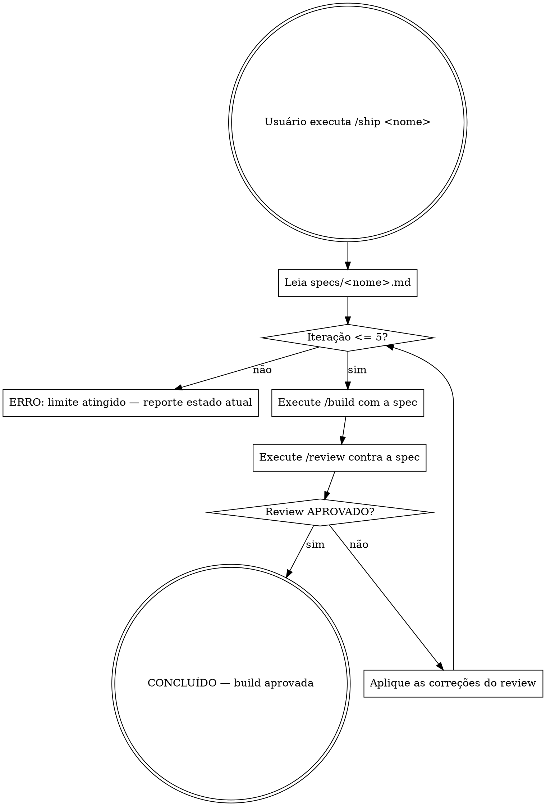

# Ship — Loop autônomo build → review até aprovação

## Overview

Execute /build, depois /review, corrija as falhas e repita — sem interromper — até que a revisão aprove 100% dos requisitos. Só pare quando a build estiver aprovada ou ao atingir o limite de iterações.

## Processo



## Invocação obrigatória das skills

A cada etapa do loop, **use o Skill tool** para invocar as skills correspondentes — não execute a lógica inline:

- **Build:** invoque a skill `build` via Skill tool com o nome da spec
- **Review:** invoque a skill `review` via Skill tool com o nome da spec

Isso garante que cada etapa siga rigorosamente as regras da skill correspondente.

## Regras do loop

- **Não interrompa para perguntar.** Qualquer ambiguidade deve ser resolvida lendo a spec. Só interrompa se a spec for genuinamente contraditória.
- **Cada iteração começa com o /review anterior.** As correções listadas no review são o único input para a próxima rodada de build.
- **Não adicione nada além das correções.** A build de correção implementa exatamente o que o review listou, nada mais.
- **Limite: 5 iterações.** Se não aprovado após 5 rodadas, pare, reporte o estado atual e as falhas restantes, e aguarde orientação do usuário.

## Como aplicar correções entre iterações

Após um review REPROVADO:

1. Liste as falhas em ordem de dependência (resolva dependências primeiro)
2. Implemente cada correção conforme descrita no review — sem interpretação livre
3. Não altere código não mencionado nas correções
4. Invoque a skill `review` novamente via Skill tool

## Saída ao concluir

```
## Ship: CONCLUÍDO ✓

Spec: specs/<nome>.md
Iterações necessárias: <N>

### Resultado do review final
- [x] <Requisito 1>
- [x] <Requisito 2>
- ...

### Definição de concluído
- [x] <Critério 1>
- [x] <Critério 2>
- ...

Build aprovada após <N> iteração(ões).
```

## Saída ao atingir o limite

```
## Ship: LIMITE ATINGIDO ✗

Spec: specs/<nome>.md
Iterações realizadas: 5

### Falhas ainda abertas
- [ ] <Requisito que não foi resolvido> — <motivo>
- ...

### Itens aprovados
- [x] <Requisito aprovado>
- ...

Intervenção necessária. Revise a spec ou as falhas acima antes de continuar.
```

## Rastreamento por iteração

A cada iteração, registre internamente:

| Iteração | Status | Falhas restantes |
|---|---|---|
| 1 | REPROVADO | N falhas |
| 2 | REPROVADO | M falhas |
| ... | ... | ... |
| N | APROVADO | 0 |

Inclua esse histórico na saída final para que o usuário entenda quantas rodadas foram necessárias.
