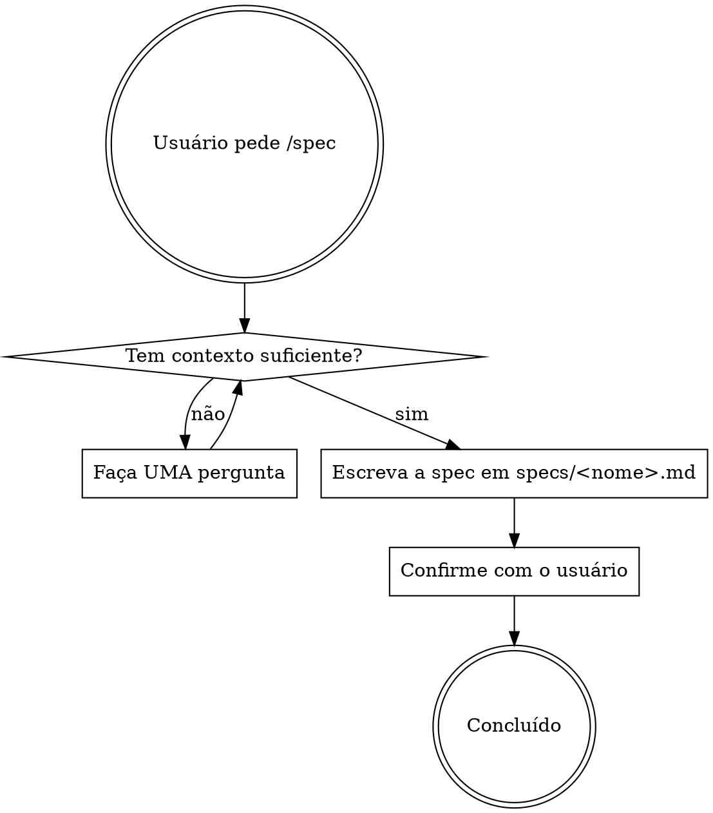

# Spec — Especificação antes de construir

## Overview

Entreviste o usuário uma pergunta por vez até entender completamente o que deve ser construído. Só então escreva a especificação. Não comece a construir.

## Processo



## Perguntas a cobrir (uma por vez, na ordem que fizer sentido)

1. **Objetivo** — O que isso faz e para quem? Qual problema resolve?
2. **Requisitos indispensáveis** — O que DEVE existir para considerar isso feito?
3. **Restrições** — Stack, ambiente, integrações existentes, limites de tempo?
4. **Casos extremos** — O que pode dar errado? Dados inválidos, usuário sem permissão, serviço fora do ar?
5. **Definição de concluído** — Como alguém verifica, sem ambiguidade, que está pronto?

Adapte a ordem e o número de perguntas ao contexto. Pare quando tiver respostas claras para todos os cinco pontos.

## Formato da spec (specs/<nome>.md)

```markdown
# <Nome do Recurso>

## Objetivo
<Uma ou duas frases: o que faz, para quem, qual problema resolve.>

## Requisitos
- <Requisito 1 — concreto e verificável>
- <Requisito 2>
- ...

## Casos extremos
- <Situação limite 1 e comportamento esperado>
- <Situação limite 2>
- ...

## Definição de concluído
- [ ] <Critério verificável 1>
- [ ] <Critério verificável 2>
- ...
```

## Regras

- **Uma pergunta por vez.** Nunca faça lista de perguntas.
- **Não comece a construir** até a spec estar salva e confirmada.
- **Não invente requisitos.** Se não foi dito, pergunte.
- **Salve em `specs/<nome>.md`** no diretório de trabalho atual. Crie a pasta `specs/` se não existir.
- O nome do arquivo deve ser kebab-case: `specs/autenticacao-google.md`, `specs/relatorio-mensal.md`.

## Erro comum

Começar a escrever a spec antes de entender a definição de concluído. Sem isso, a spec é incompleta — o desenvolvedor não saberá quando parar.
